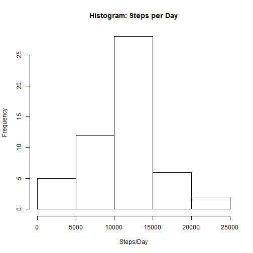
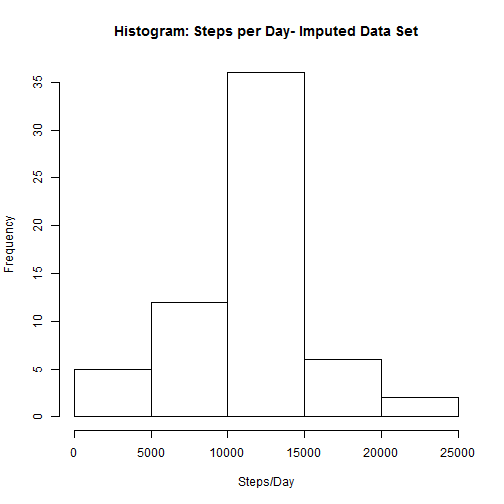

## Loading and preprocessing the data
1. Load the data
2. Process/transform the data (if necessary) into a format suitable for your analysis

```r
wd <- getwd()
fpath <- file.path(wd,"activity_mon.rds")
url <- "https://d396qusza40orc.cloudfront.net/repdata%2Fdata%2Factivity.zip"
if(!file.exists(fpath)){
  ## generate temp files/dirs to fetch zip file, and unzip data
  temp <- tempfile()
  download.file(url,temp)
  zipdir <- tempfile()
  dir.create(zipdir)
  unzip(temp, exdir=zipdir)
  files <- list.files(zipdir)
  ## read data to pwrdat variable
  activity_dat <- read.table(paste(zipdir, files[1], sep = "/"),header=TRUE, sep=',', na.strings='NA', colClasses=c("numeric","character","numeric"))
  ## unlink temporary files
  unlink(temp)
  unlink(zipdir)
  activity_dat$date <- as.Date(activity_dat$date,"%Y-%m-%d")
  ## save cache data
  saveRDS(activity_dat, fpath)

}
if(file.exists(fpath)) {
  ## fetch cache data, data found
  activity_dat <- readRDS(fpath)
}
```


## What is mean total number of steps taken per day?

1. Make a histogram of the total number of steps taken each day


```r
steps_per_day <- aggregate(steps ~ date, data = activity_dat, FUN = sum)
hist(steps_per_day$steps,main='Histogram: Steps per Day',xlab='Steps/Day',)
```

 

2. Calculate and report the mean and median total number of steps taken per day

Mean:

```r
spd_mean <- mean(steps_per_day$steps)
spd_mean
```

```
## [1] 10766.19
```

Median:

```r
spd_median <- median(steps_per_day$steps)
spd_median
```

```
## [1] 10765
```

## What is the average daily activity pattern?

1. Make a time series plot (i.e. type = "l") of the 5-minute interval (x-axis) and the average number of steps taken, averaged across all days (y-axis)


```r
steps_per_interval <- aggregate(steps ~ interval, data = activity_dat, FUN = mean)
plot(steps_per_interval, type = "l")
```

 

2. Which 5-minute interval, on average across all the days in the dataset, contains the maximum number of steps?


```r
steps_per_interval$interval[which.max(steps_per_interval$steps)]
```

```
## [1] 835
```

## Imputing missing values
1. Calculate and report the total number of missing values in the dataset (i.e. the total number of rows with NAs)


```r
sum(is.na(activity_dat))
```

```
## [1] 2304
```

2. Devise a strategy for filling in all of the missing values in the dataset. The strategy does not need to be sophisticated. For example, you could use the mean/median for that day, or the mean for that 5-minute interval, etc.

Executed strategy: mean per 5-minute interval to fill in NA values. Interval values will be rounded towards 0.

3. Create a new dataset that is equal to the original dataset but with the missing data filled in.


```r
imputed_act <- merge(activity_dat,steps_per_interval, by = "interval")
imputed_act$steps.y <- floor(imputed_act$steps.y)
imputed_act$steps.x <- ifelse(is.na(imputed_act$steps.x),imputed_act$steps.y,imputed_act$steps.x)
```

4. Make a histogram of the total number of steps taken each day and Calculate and report the mean and median total number of steps taken per day. Do these values differ from the estimates from the first part of the assignment? What is the impact of imputing missing data on the estimates of the total daily number of steps?


```r
spd_imputed <- aggregate(steps.x ~ date, data = imputed_act, FUN = sum)
hist(spd_imputed$steps,main='Histogram: Steps per Day- Imputed Data Set',xlab='Steps/Day',)
```

 

Mean:

```r
spdi_mean <- mean(spd_imputed$steps)
spdi_mean
```

```
## [1] 10749.77
```

Median:

```r
spdi_median <- median(spd_imputed$steps)
spdi_median
```

```
## [1] 10641
```

Original vs Imputed Mean (% difference):


```r
abs((spd_mean - spdi_mean)/spd_mean)*100
```

```
## [1] 0.1524977
```

Original vs Imputed Median (% difference):


```r
abs((spd_median - spdi_median)/spd_median)*100
```

```
## [1] 1.151881
```

Mean and median values slightly differ from original set with NAs omitted. As change is around or less than 1%, the impact is negligible.

## Are there differences in activity patterns between weekdays and weekends?

1. Create a new factor variable in the dataset with two levels - "weekday" and "weekend" indicating whether a given date is a weekday or weekend day.


```r
daytype <- ifelse(weekdays(activity_dat$date) %in% c("Saturday","Sunday"),"weekend","weekday")
activity_dat$daytype <- as.factor(daytype)
```

2. Make a panel plot containing a time series plot (i.e. type = "l") of the 5-minute interval (x-axis) and the average number of steps taken, averaged across all weekday days or weekend days (y-axis). See the README file in the GitHub repository to see an example of what this plot should look like using simulated data.


```r
par(mfrow = c(2, 1))
for (i in c("weekend", "weekday")) {
    daytype_steps <- aggregate(steps ~ interval, data = activity_dat, subset = activity_dat$daytype == 
        i, FUN = mean)
    plot(daytype_steps, type = "l", main = i)
}
```

 
